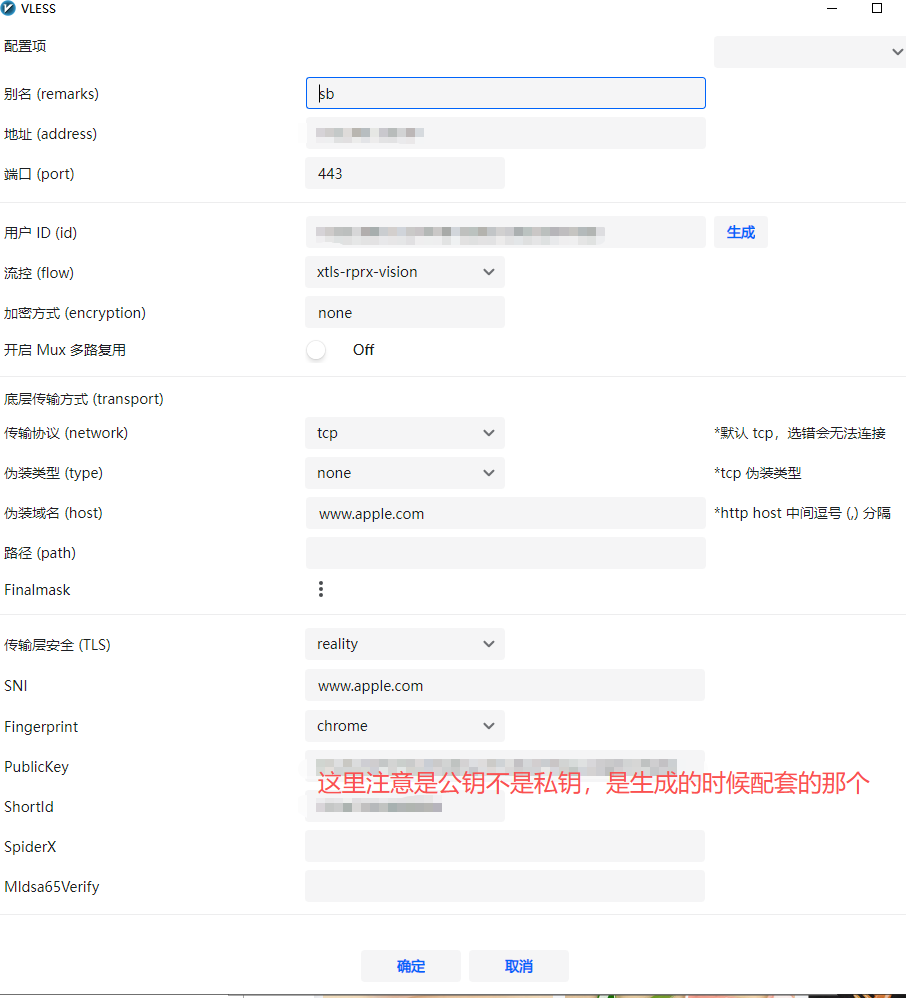

+++
date = '2026-04-20T14:29:06+08:00'
draft = false
title = '**VLESS + XHTTP + TLS + CDN**vs**VLESS + Reality + TLS**vs**Hysteria2**'

+++

上行cdn，下行reality，这里说的上行和下行是并非指我们常规理解的上传/下载速度，而是指**数据包往返的路径（通道）选择**。

- **上行 (Inbound/Upload Path)**：指**客户端 -> 服务器**的请求。
  - 这个阶段的核心任务是**“掩护”**。你需要让防火墙觉得你是在访问一个合法的网站。
  - **CDN 方案**：由于流量先经过 Cloudflare 等大厂节点，防火墙看到的是你和合法的 CDN 节点在通信，隐蔽性极高。
- **下行 (Outbound/Download Path)**：指**服务器 -> 客户端**的响应。
  - 这个阶段的核心任务是**“速度”**。
  - **REALITY 方案**：它是直连方案，不经过中转，因此没有 CDN 带来的高延迟和限速问题，能够跑满你的 VPS 带宽。

> **逻辑总结**：这种“分流”做法是试图结合 CDN 的**抗封锁性**（上行隐藏）和 REALITY 的**极速表现**（下行直连）。

### 3 种方案对比表

| **特性**     | **VLESS + XHTTP + TLS + CDN**                                | **VLESS + Reality + TLS**            | **Hysteria2 (UDP-based)**                                    |
| ------------ | ------------------------------------------------------------ | ------------------------------------ | ------------------------------------------------------------ |
| **核心传输** | HTTP 报文分段 (XHTTP)                                        | TLS 握手借用 (Reality)               | QUIC / UDP 暴力重传                                          |
| **伪装等级** | **极高**（伪装成正常的 HTTP 请求）                           | **天花板**（扫描者看到的是大厂官网） | 中（明显的 UDP 流量）                                        |
| **抗封锁性** | **最强**（CDN 隐藏 IP + HTTP 混淆）                          | 优秀（靠“像”真实网站逃避检测）       | 一般（靠“变”和“快”硬刚）                                     |
| **连接速度** | 较慢（CDN 转发有损耗）                                       | 快（接近直连）                       | **极快**（丢包环境下表现最佳）                               |
| **配置难度** | 复杂（需域名、证书、CDN 接入）                               | 中等（需配置 SNI 和短 ID）           | 简单（通常只需密码和证书）                                   |
| **主要用途** | **IP 已被封**或敏感期“续命”                                  | 长期主力使用，防检测首选             | 垃圾线路或高峰期抢带宽神器                                   |
| **缺点**     | 经过CDN中转，哪怕是优选ip，也经过多一道中转，游戏用户基本告别 | 不是最强，但也不是最差               | **容易被 QoS**：部分省份的运营商对 UDP 流量极度反感，识别出大流量 UDP 会直接断流或限速。<br />**特征明显**：虽然有跳频和 Padding，但 UDP 协议本身在防火墙眼中就是“高危行为”。 |

虽然 **CDN**（内容分发网络）和 **WARP**（Cloudflare 提供的 VPN 服务）都出自 Cloudflare 这样的大厂，且都涉及 IP 跳转，但它们在网络链路中的**位置**和**作用**完全相反。

简单来说：**CDN 保护的是“服务器”，而 WARP 保护的是“出口”。**

------

### 核心区别对照表

| **特性**       | **CDN (如 Cloudflare CDN)**             | **WARP (Cloudflare WARP)**                        |
| -------------- | --------------------------------------- | ------------------------------------------------- |
| **位置**       | 位于 **VPS 之前** (前置)                | 位于 **VPS 之后** (后置)                          |
| **主要目的**   | 隐藏 VPS 真实 IP，防止 VPS 被封或被攻击 | 隐藏 VPS 原始出口，解锁流媒体或防止被封           |
| **保护对象**   | 保护你的**服务器**不被防火墙发现        | 保护你的**访问目标**（如 Google/Netflix）不识别你 |
| **流量方向**   | 客户端→**CDN** → VPS                    | VPS →**WARP** →目标网站                           |
| **对速度影响** | 通常会增加延迟（需中转）                | 几乎无损，甚至能优化 VPS 到目标的路由             |

另外**CDN 的本质是中间人**：目前绝大多数主流 CDN（如 Cloudflare 的免费版）主要针对 **HTTP/TCP** 流量进行加速和转发。而**Hysteria2 的灵魂是 UDP**：它之所以快，是因为它基于 QUIC 协议，不使用 TCP 那种死板的“确认-等待”机制。所以如果用Hysteria2 方案，就无法套cdn，不然就等于自废武功目前2026年4月20日还是**Hysteria2 + 端口跳跃**（物理躲避）

### 进阶玩法（上行VLESS + Reality；下行Hysteria2+warp）

可以在 v2rayN 中同时保留这两个节点：

1. **作为主力的下行工具**：使用你现在的 **Hysteria2**。设置 v2rayN 路由，将大流量域名（YouTube, Netflix）强制走这个节点。
2. **作为主力的上行工具**：使用 **VLESS + Reality**。将一些对稳定性要求极高的域名（如 GitHub, OpenAI, 银行后台）走这个节点。

通过 v2rayN 的**路由功能**实现**按需分流**。理论上应该可以，未实际验证。配置比较复杂……

------

#### 实践vps手搓Hysteria2+端口跳跃+warp

需要域名（二级域名也行）1个，托管到cloudflare，dns解析vps的ip，关闭小云朵；ssl完全（严格）


**ACME 自动化**：建议使用 `acme.sh` 配合 DNS 验证自动更新证书，否则证书过期会导致连接瞬间中断。

**操作步骤：**

1. **安装 acme.sh:**

   Bash

   ```
   curl https://get.acme.sh | sh
   ```

2. **申请证书（以 Cloudflare DNS 为例）:**

   Bash

   ```
   export CF_Email="你的邮箱"
   export CF_Key="你的API密钥"
   ~/.acme.sh/acme.sh --issue --dns dns_cf -d 你的域名
   ```

3. **安装证书到 Hysteria 目录：**

   Bash

   ```
   ~/.acme.sh/acme.sh --install-cert -d 你的域名 \
   --key-file       /etc/hysteria/private.key  \
   --fullchain-file /etc/hysteria/fullchain.cer \
   --reloadcmd     "systemctl restart hysteria2"
   ```

   *这样每当证书更新，Hysteria 都会自动重启加载新证书。*

##### 安装hy2脚本

bash <(curl -fsSL https://get.hy2.sh/)

配置文件 (`/etc/hysteria/config.yaml`)：

```
listen: :443

tls:
  cert: /etc/hysteria/fullchain.cer
  key: /etc/hysteria/private.key

auth:
  type: password
  password: "密码"

masquerade:
  type: proxy
  proxy:
    url: https://www.ucla.edu
    rewriteHost: true

quic:
  initStreamReceiveWindow: 8388608
  initConnReceiveWindow: 20971520
  hopInterval: 30s
  ignoreClientBandwidth: true

outbounds:
  - name: warp
    type: socks5
    socks5:
      addr: 127.0.0.1:40000

acl:
  inline:
    - direct(geoip:private)
    - direct(geoip:cn)
    - direct(geosite:cn)
    - warp(all)
```

**启动 Hy2**：

```
systemctl enable hysteria-server.service
systemctl restart hysteria-server.service
```

**检查状态**：

```
systemctl status hysteria-server.service
```

如果显示 `active (running)`，说明配置成功。

### 客户端 v2rayN 配置对齐

Hy2 官方版在 v2rayN 中的配置非常简单：

1. **服务器类型**：选择 **Hysteria2**。

2. **地址/端口**：你的域名 / 443。

3. **认证**：填写你在 `password` 处设置的密码。

4. **TLS/SNI**：开启 TLS，SNI 填写你的域名。

5. **重要（带宽优化）**： 在客户端设置里找到 `Upstream/Downstream`（上行/下行）：

   - **Down (下行)**: 填写 `100 Mbps`（根据你 VPS 的标称带宽填）。
   - **Up (上行)**: 填写 `20 Mbps`。

   > **原理**：Hysteria2 会根据这两个数值主动控制发包节奏。填入合理的数值可以有效防止运营商对 UDP 流量进行惩罚性限速。


记得关闭分片，hy2不用这个；路由模式默认下面这样即可


#### 安装warp

###### 获取 WARP 账号的关键参数

你需要获取四个核心参数：`PrivateKey`、`Address` (v4和v6)、`Reserved` 值以及 `PublicKey`。

目前最简单且推荐的方法是使用自动化脚本生成。在你的 VPS 上执行以下命令（选择其中一种即可）：

###### 方法 A：使用单行脚本（推荐）

Bash

```
wget -N https://gitlab.com/fscarmen/warp/-/raw/main/api.sh && bash api.sh
```

- 运行后按照提示选择“注册账号”。
- 脚本会直接输出包含 `private_key` 和 `reserved` (通常是三个数字，如 `[123, 45, 67]`) 的信息。
- **注意**：`Reserved` 值非常关键，如果填错，你的流量可能无法被 Cloudflare 正确识别。

**运行脚本**：`wget -N https://gitlab.com/fscarmen/warp/-/raw/main/menu.sh && bash menu.sh`

**选择模式**：选择 **“为已有的 WireGuard 客户端添加 ”** 或者 **“安装 WARP Go”**。

**分流设置**：选 **“Socks5 代理模式”**，端口设为 `40000`。

**IP 选择**：选 **“双栈”**。

### 手动开启端口转发（确保客户端能连上）

直接在终端执行这两行，这不需要安装任何包，立即生效：

Bash

```
# 核心：将 20000-30000 的流量转发到 443 端口
iptables -t nat -A PREROUTING -p udp --dport 20000:30000 -j REDIRECT --to-ports 443

# 放行 443 端口
iptables -I INPUT -p udp --dport 443 -j ACCEPT

#老debian10可能需要更换源才能安装下面的
sed -i 's/deb.debian.org/archive.debian.org/g' /etc/apt/sources.list
sed -i 's/security.debian.org/archive.debian.org/g' /etc/apt/sources.list
sed -i '/stretch-updates/d' /etc/apt/sources.list

apt update && apt install iptables-persistent -y
netfilter-persistent save

iptables -t nat -L PREROUTING -n -v --line-numbers #检查是否成功
```

###  系统内核优化 (Debian/Linux)

既然你在 Debian 环境下运行，务必开启 **BBR** 以及优化 UDP 缓冲区，否则 Hysteria 的性能会受限于系统底层。

在 `/etc/sysctl.conf` 中添加：

Bash

```
# 开启 BBR
net.core.default_qdisc = fq
net.ipv4.tcp_congestion_control = bbr

# 增加 UDP 缓冲区大小，防止高并发时丢包
net.core.rmem_max = 16777216
net.core.wmem_max = 16777216
```

执行 `sysctl -p` 生效。

### 配置好之后客户端进行网页检测（最直观）

在连接节点的状态下，打开浏览器访问 Cloudflare 官方的调试界面： **👉 https://www.cloudflare.com/cdn-cgi/trace**

```
ip=cloudflare的ip
warp=on
```

表示成功


删除hy2，电信网对udp宽容点，广电网udp被封太严重了，实际测试下来速度非常慢！

```
systemctl stop hysteria-server.service
systemctl disable hysteria-server.service
rm -f /usr/local/bin/hysteria
rm -rf /etc/hysteria
rm -f /etc/systemd/system/hysteria2.service
systemctl daemon-reload
iptables -t nat -D PREROUTING -p udp --dport 20000:30000 -j REDIRECT --to-ports 443
iptables -D INPUT -p udp --dport 443 -j ACCEPT
netfilter-persistent save
```

------

# 改用VLESS + Reality + 内置 WARP方案

### 1，vps端内核确定

| **特性**           | **Xray-core**                       | **Sing-box**                      |
| ------------------ | ----------------------------------- | --------------------------------- |
| **Reality 兼容性** | 原生首发，最稳定                    | 完美支持                          |
| **WARP 集成方式**  | 通过 Outbound 配合 Wireguard 二进制 | 原生内置 Wireguard 模块，效率更高 |
| **历史**           | 老                                  | 新                                |
| **资源消耗**       | 较低                                | 极低                              |
| **分流灵活性**     | 优秀                                | 极致（支持脚本化逻辑）            |

综上所述，vps端决定采用singbox内核，注意vps端和客户端是不同的，客户端用v2rayn的xray内核就行了

## 2，安装singbox

https://sing-box.sagernet.org/installation/package-manager/

官方说明文档

```
curl -fsSL https://sing-box.app/install.sh | sh
```

安装完成后，配置文件路径通常为：`/etc/sing-box/config.json`

### 第二步：生成必备密钥

Reality 需要一对 **椭圆曲线公私钥**。

Bash

```
# 生成 Reality 密钥对
sing-box generate reality-keypair
# 它会输出 Private Key (私钥) 和 Public Key (公钥)
# 另外生成一个 UUID 作为用户 ID
sing-box generate uuid
# 生成一个 Short ID（16位十六进制，如 62eb1d...）
sing-box generate rand --hex 8
```

**请记录下这四个值，下面的config填入配置。**

### 第三步：编写配置文件

清空 `/etc/sing-box/config.json`，参考以下模板进行修改。

```
{
  "log": {
    "level": "warn",
    "timestamp": true
  },
  "dns": {
    "servers": [
      {
        "tag": "dns-warp",
        "type": "https",
        "server": "1.1.1.1",
        "server_port": 443,
        "tls": {
          "enabled": true,
          "server_name": "cloudflare-dns.com"
        },
        "detour": "warp-out"
      },
      {
        "tag": "dns-direct",
        "type": "udp",
        "server": "8.8.8.8",
        "server_port": 53
      }
    ],
    "rules": [
      {
        "rule_set": "geosite-cn",
        "action": "route",
        "server": "dns-direct"
      }
    ],
    "final": "dns-warp"
  },
"endpoints": [
    {
      "type": "wireguard",
      "tag": "warp-out",
      "address": [
        "172.16.0.2/32",
        "warp获取到的那个ipv6地址/128"
      ],
      "private_key": "用warp那个bash api.sh -r生成的那个同上面hy2",
      "mtu": 1280,
      "peers": [
        {
          "address": "162.159.192.1",
          "port": 2408,
          "public_key": "bmXOC+F1FxEMF9dyiK2H5/1SUtzH0JuVo51h2wPfgyo=",
          "allowed_ips": [
            "0.0.0.0/0",
            "::/0"
          ],
          "reserved": [warp的那个]
        }
      ],
      "domain_resolver": "dns-direct"
    }
  ],
  "inbounds": [
    {
      "type": "vless",
      "tag": "vless-in",
      "listen": "::",
      "listen_port": 443,
      "users": [
        {
          "uuid": "获取到的那个uuid",
          "flow": "xtls-rprx-vision"
        }
      ],
      "tls": {
        "enabled": true,
        "server_name": "www.apple.com",
        "reality": {
          "enabled": true,
          "handshake": {
            "server": "www.apple.com",
            "server_port": 443
          },
          "private_key": "sing-box generate reality-keypair生成的那个",
          "short_id": [
            "sing-box generate rand --hex 8生成的那个"
          ]
        }
      }
    }
  ],
  "outbounds": [
    {
      "type": "direct",
      "tag": "direct"
    },
    {
      "type": "block",
      "tag": "block"
    }
  ],
  "route": {
    "rule_set": [
      {
        "tag": "geoip-cn",
        "type": "remote",
        "format": "binary",
        "url": "https://raw.githubusercontent.com/SagerNet/sing-geoip/rule-set/geoip-cn.srs",
        "download_detour": "direct"
      },
      {
        "tag": "geosite-cn",
        "type": "remote",
        "format": "binary",
        "url": "https://raw.githubusercontent.com/SagerNet/sing-geosite/rule-set/geosite-cn.srs",
        "download_detour": "direct"
      }
    ],
    "rules": [
      {
        "ip_is_private": true,
        "action": "route",
        "outbound": "block"
      },
      {
        "rule_set": ["geoip-cn", "geosite-cn"],
        "action": "route",
        "outbound": "direct"
      }
    ],
    "final": "warp-out",
    "default_domain_resolver": "dns-direct",
    "auto_detect_interface": true
  }
}
```

### 第四步：启动与检查

1. **验证配置语法**： `sing-box check -c /etc/sing-box/config.json`
2. **启动服务**： `systemctl enable --now sing-box`
3. **查看状态**： `systemctl status sing-box`

如果后续有修改配置，修改完后

```
systemctl restart sing-box
```

### 第五步：客户端v2rayn添加节点

###### 1. 基础信息填写

打开 v2rayN，点击 **“服务器”** -> **“添加 [VLESS] 服务器”**：

- **别名**：自定义（例如：Racknerd-Reality）
- **地址 (Address)**：填入你 VPS 的 **IP 地址**
- **端口 (Port)**：`443`（需与服务端 inbound 端口一致）
- **用户 ID (UUID)**：填入你在 `config.json` 中配置的那个 UUID
- **流控 (flow)**：选择 **`xtls-rprx-vision`**（这是 Reality 的标配）

------

###### 2. 传输层与 Reality 关键配置

这是最核心的部分，请切换到下方的 **“传输设置 (Transport)”** 栏目：

- **传输协议**：选择 `tcp`
- **伪装类型**：选择 `none`
- **底层传输安全 (Stream Security)**：**必须选择 `reality`**

此时会弹出 Reality 的专用输入框：

- **SNI (Server Name)**：填入你服务端配置的域名（如 `www.microsoft.com`）

- **Fingerprint (指纹)**：建议选择 **`chrome`**

- **PublicKey (公钥)**：填入你服务端 `private_key` 对应的 **`public_key`**（注意：不是私钥，是配套生成的公钥）

- **ShortId**：填入服务端 `short_id` 列表中的其中一个（例如 `你的ShortID`）

- **SpiderX**：留空即可

  

v2rayN 节点编辑界面的以下设置：

| **设置项**          | **建议值**         | **原因**                             |
| ------------------- | ------------------ | ------------------------------------ |
| **流控 (Flow)**     | `xtls-rprx-vision` | **必须开启**，Reality 的核心安全特性 |
| **Mux 多路复用**    | `关闭 / 不勾选`    | 避免干扰 Vision 流控，提高隐蔽性     |
| **分片 (Fragment)** | `关闭`             | Reality 已足够隐蔽，无需额外干扰     |
| **跳过证书验证**    | `false` (不勾选)   | Reality 不需要跳过验证，保持安全     |

### 第六步：优化

###### 1. 开启 BBR 加速 (必做)

BBR 是 Google 开发的拥塞控制算法，能显著提升高延迟、丢包环境下的带宽利用率。这个同hy2上面的配置

###### 2. 优化系统文件句柄限制

在高并发连接时，Linux 默认的限制可能会导致掉线。

- 编辑文件：`nano /etc/security/limits.conf`

- 在末尾添加：

  ```
  * soft nofile 51200
  * hard nofile 51200
  ```

###### 3. 检查系统时间同步

Reality 协议对时间非常敏感，时间偏移超过 30 秒可能导致连接失败。

```
timedatectl set-ntp true
date  # 确认时间是否与当前北京时间一致（UTC+8）
```

