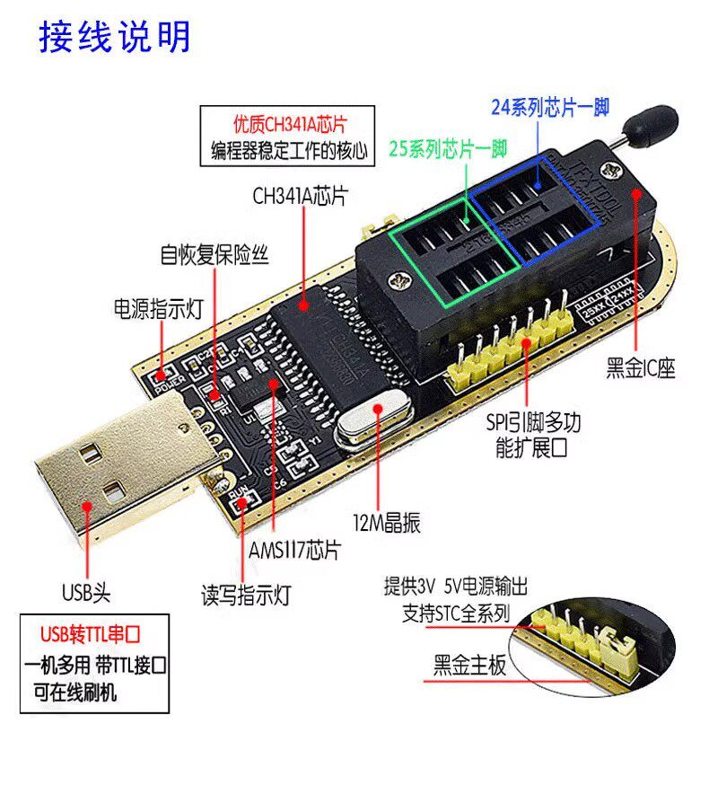
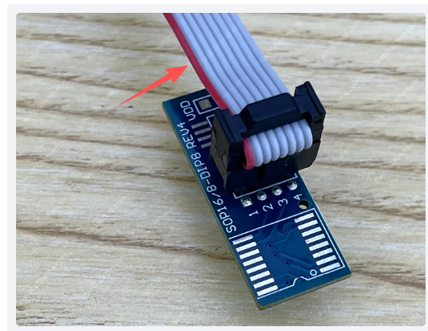
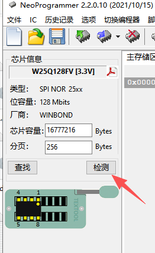

+++
date = '2026-04-03T17:01:56+08:00'
draft = false
title = 'ch341a编程器使用'

+++

# 一：硬件部分

首先确定本次要刷的芯片是属于24还是25的，ch341插座分为24和25部分

本次刷的是W25Q128FVSG，属于（25Q128FV 系列）的 SPI NOR Flash 芯片，所以是插下半部的25部位

然后确定芯片电压，ch341通过跳线控制，黄色帽短接1,2提供3.3v；短接2，3提供5v，千万不要接错

我没有买专用的插座（穷），是直接用夹子接芯片刷的，夹子接的话，会导致芯片引脚变形，刷完后要自己手动掰正。。

夹子线的红线是对应芯片的原点1脚，不要夹错

# 二：软件部分

夹好之后，直接把ch341a通过usb接口插电脑，然后打开NeoProgrammer开始刷，如果是初次的话，需要Windows设备管理器硬件那里添加好驱动（NeoProgrammer文件夹里面有驱动文件）

**操作流程**（通用）：

1. 插入编程器 → 打开软件 → 点击检测

   

2. 选择芯片型号：**W25Q128FV** 或 **W25Q128FVSG**（FVSG 通常兼容 FV，注意型号一定要搞错，对应自己购买的具体型号！）

3. 先 **Detect / 读取 ID** 确认识别正确。

4. **Read** 全片备份（不是重要芯片这步可以省略）。

5. 擦除 → “文件——打开自己下载好需要刷的bin文件”——写入新固件 → **Verify** 校验。

   

一切搞定之后，拔出ch341a，然后松开夹子即可
