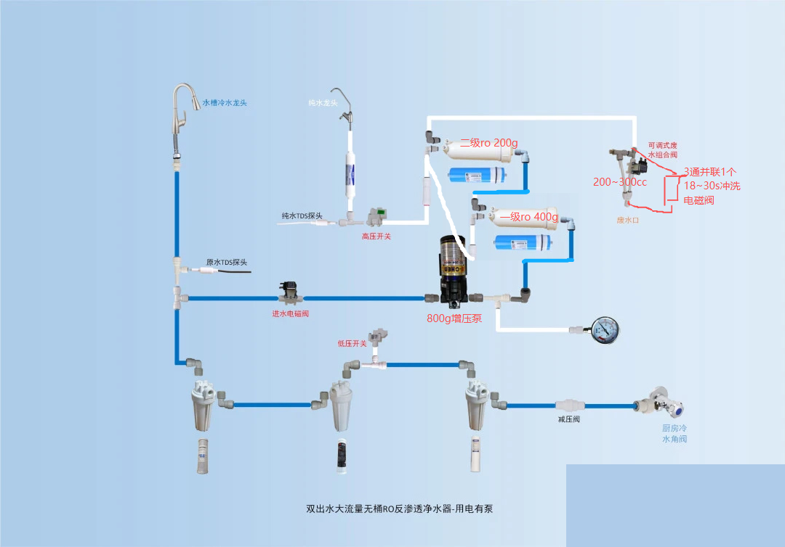
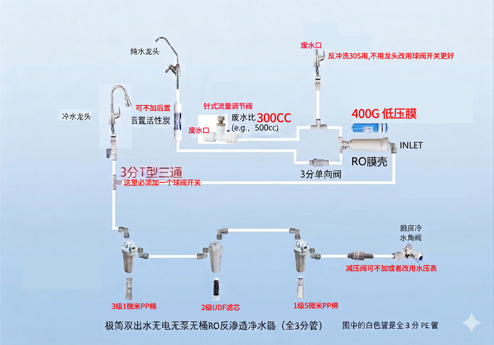
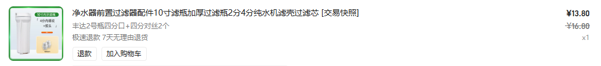
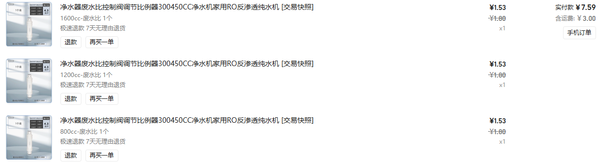
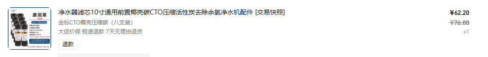

+++
date = '2026-05-11T11:01:20+08:00'
draft = false
title = '净水方案'

+++

人体的肾很强，过滤能力很强，但肾再强也有限度，而且随着年龄增长，更应该给肾减轻负担，因此现世中，我们应该利用物理过滤出纯净水引用

核心原则：节点尽可能少，尽可能采用机械设计，减少中间环节，减少未来故障点，综合考虑有泵方案和无泵方案，最终决定用后者

有泵方案，二级ro膜串联，废水比可以降低到1:5

无泵方案，废水比1:1，RO膜净水部分采用双球阀开关设计（替代四面阀方案），每次使用净水前，先在关闭净水龙头，开启30s球阀龙头，开启净水球阀开关，冲洗18~30s后关闭冲洗球阀开关，打开净水龙头正常使用即可。

开关球阀1和2分别通过底座固定到大白瓶顶盖上或者墙壁，直接用现在华凌的壳进行改装就行

### 1. RO膜规格建议：建议 400G 或 600G

对于无泵系统，不建议选择常见的800G或1000G大规格，也不建议选太小的50G/75G。

- **为什么选400G/600G？**
  - **产水效率：** 无泵系统的动力仅靠自来水压（通常2-4kg）。由于没有泵的高压（5-8kg），RO膜的实际产水量会缩减到标称值的**30%-50%**。400G的膜在无泵状态下，流速大约等同于普通饮水机的细水长流，能勉强满足2人日常饮用和煮饭。
  - **废水比控制：** 膜规格越大，对压力要求越高。如果选800G以上的膜而水压不足，废水会极多，且膜容易迅速堵塞。
- **关键指标：** 选购时请务必认准“低压膜”（Low Pressure Membrane）。

------

废水比阀（比例器）的核心作用是在膜腔内建立**压力**。废水规格（cc值）的大小，本质上是在**滤膜寿命**和**出水效率**之间做平衡。

### 1. 如果 cc 值选得太大（废水排得太多）

- **后果：** 膜腔内压力不足。
- **产水慢：** 就像漏风的风箱，压力都从废水管跑了，推不动水分子穿过 RO 膜。
- **水质差（TDS值高）：** 因为压力不够，RO 膜的脱盐率会下降，过滤不彻底。
- **浪费水：** 纯水出一小杯，废水流了一大桶。

### 2. 如果 cc 值选得太小（废水排得太少）

- **后果：** 膜腔内压力极高，浓水浓度过大。
- **容易堵塞：** 钙、镁等离子排不出去，会在膜表面迅速结晶（结垢）。可能原本能用 2 年的膜，3 个月就报废了。
- **损坏硬件：** 尤其在无泵系统中，虽然压力来自自来水，但如果完全堵死废水，压力会导致滤瓶或接头爆裂。

------

### 3. 如何判断 cc 值是否合适？

你可以参考下表来衡量你的 600G 系统在不同规格下的表现：

| **废水阀规格**            | **对膜的影响**   | **对出水的影响**      | **适用场景**                 |
| ------------------------- | ---------------- | --------------------- | ---------------------------- |
| **偏小 (如 800cc)**       | 容易结垢，寿命短 | 产水速度快，TDS低     | 原水 TDS 较低（<100）的地区  |
| **标准 (如 1000-1200cc)** | 寿命与效率平衡   | 产水稳定              | 大多数家庭                   |
| **偏大 (如 1500cc+)**     | 膜很干净，寿命长 | **产水极慢**，TDS偏高 | 无泵方案不建议，除非水压极高 |

先从800cc开始测试，然后1200cc-1600cc，tds笔测值是否有升高，找到最合适的值

## 无泵600G低压RO最佳前三级：

### 第一级（3~6个月更换）

5μm 沟槽PP，35元/10个

### 第二级（6~12个月更换）

5μm 低压损 CTO（不要选UDF，UDF碳粉更多；去氯稳定性不如CTO；长期容易掉粉；对RO膜保护不如CTO）

### 第三级（6~12个月更换）

1或者3μm 平滑PP ，平面拉丝/光面 43元/10个

### 第四级：600G低压RO膜（2年一换）

