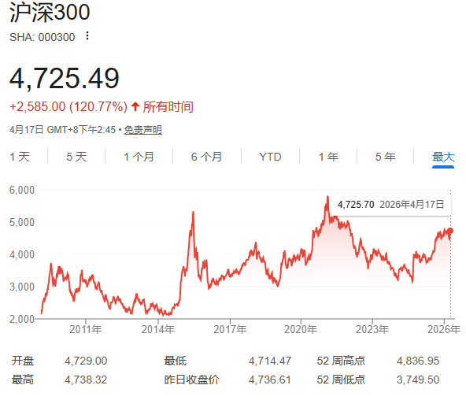
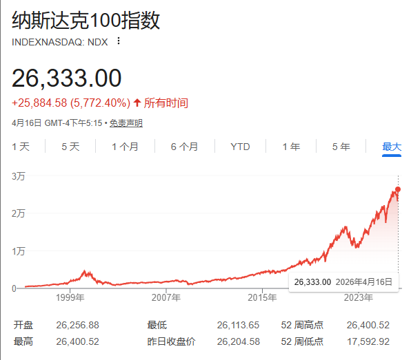
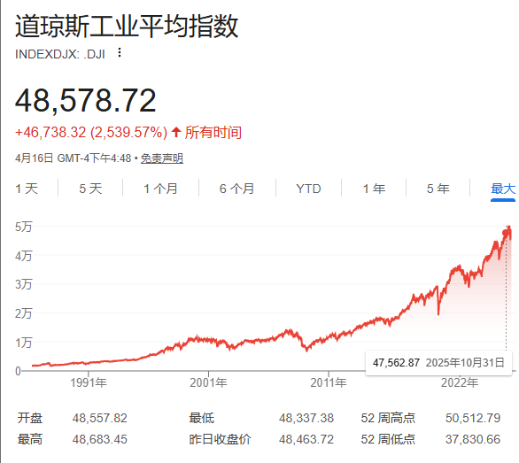
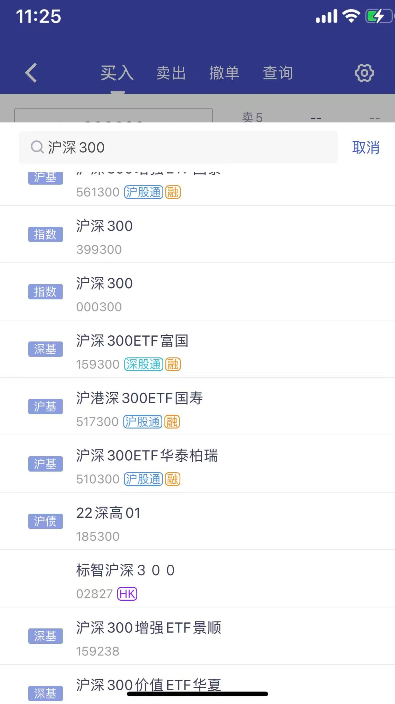
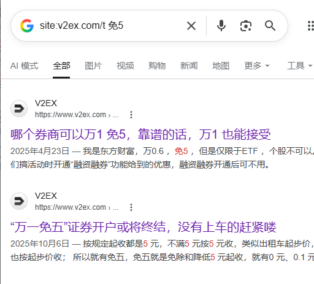
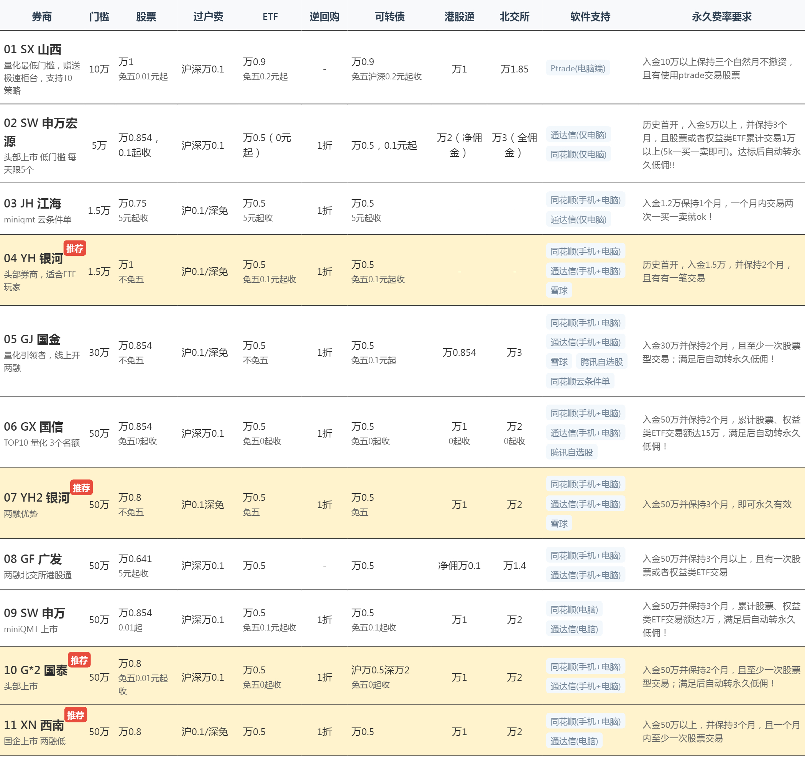

+++
date = '2026-04-16T15:33:50+08:00'
draft = false
title = '财务自由·我的10年后退休计划'

+++

*温馨提示：以下文章所有内容均为本人咨询AI瞎jb乱写，不构成任何投资建议，投资有风险，请谨慎！请勿模仿，如有损失，均与本人无关！！*

# 一、目标

#### 现在我35岁，假设能活到100岁，根据以往，我个人年平均支出3w元，希望在10年后，45岁实现财务自由

------

原先我的错误线性思维计算方式：

近3年的总支出/3*（100-35））

那么财务自由预计需要：3*65=195w

再假设能工作到45岁，那么还剩10年，需要195/10=19.5/年

每个月需要19.5/12=1.625w

- 你假设未来 65 年的支出都按现在的价格算，但实际生活成本会持续上升。
- 举例：如果通胀率 3%，35 岁时 3 万元的购买力，在你 65 岁时大概只相当于现在的 **1 万元**。
- 所以未来需要的钱要远大于 195 万。

👉 修正思路：
 可以用复利公式估算通胀后的支出：
$$
未来支出 = 年支出 × \frac{(1+通胀率)^{年数} - 1}{通胀率}
$$
例如，3 万/年，通胀率 3%，持续 65 年：
$$
= 3 × \frac{(1.03)^{65} - 1}{0.03} ≈ 3 × 152 ≈ 456 万
$$
所以**真实总需求 ≈ 450～500 万**。

------

#### 2️⃣ 没考虑 **投资收益或被动收入**

- 如果你投资（如基金、债券、房租、股息等）平均年收益 4~6%，那本金需求会显著下降。

- 一般财务自由定义是：

  > **资产 × 年收益率 ≥ 年支出**

  如果年支出 3 万、目标收益率 5%，
   则只需3 / 0.05 = 60 万的可持续投资本金即可。
   当然这是假设支出、收益稳定且通胀抵消的情况。

------

#### 3️⃣ 没区分“**储蓄到财务自由**”与“**被动收入覆盖支出**”

你的算法属于“攒够未来所有生活费”，
 而现实中更多人追求的是“资产能自己产生足够现金流”。

也就是说，
 ✅ 如果你攒够 195 万且不动用本金，投资年化收益 5%，
 → 年收益 9.75 万，完全能覆盖 3 万支出。
 那你**已经财务自由**了。
 而不必攒到几百万“够花一辈子”。

------

#### 4️⃣ 没考虑 **支出结构变化**

- 退休后支出可能下降（通勤、教育、住房成本减少），
- 但医疗支出可能增加。
- 所以按固定 3 万/年可能过于简化，但对于“平均估算”也可以接受。

------

### ✅ 更合理的改进版模型：

假设：

- 目标：年支出 3 万（以今日币值）
- 通胀：3%
- 投资回报率：5%
- 当前年龄：35 岁
- 希望 45 岁实现财务自由（10 年后）

👉 按照“4%法则”（FIRE 理论常用经验值）：
$$
财务自由所需本金 = 年支出 × 25 = 3 × 25 = 75 万
$$
但是这个“3 万”是现在币值，10 年后通胀 3%，折算成：
$$
3 × (1.03)^{10} ≈ 4.0 万
$$
所以实际目标本金：
$$
4 × 25 = 100 万左右
$$
也就是说：

> 你需要在 45 岁前攒到 **约 100 万可投资资产**，并维持 5% 左右年化收益率，就能实现财务自由。

------

### 🧭 总结：

| 项目     | 你的计算   | 改进后（考虑通胀+收益）      |
| -------- | ---------- | ---------------------------- |
| 目标本金 | 195 万     | ≈ 100 万（4%法则）           |
| 模型假设 | 静态攒钱   | 动态投资+通胀                |
| 每月目标 | 1.6 万存款 | 若10年攒100万，则约0.83万/月 |

------

# 二、中美股认识

中国：只考虑沪深300就行（**沪深300代表“中国国运”**）

| 对比项         | 沪深300                                                      | 中证A500                                                     |
| :------------- | :----------------------------------------------------------- | :----------------------------------------------------------- |
| **成分股数量** | 300只                                                        | 500只                                                        |
| **选股逻辑**   | 按市值大小简单排名，选前300大                                | 按“行业均衡”原则选股，确保每个行业都有代表性                 |
| **行业分布**   | 金融(国资)、传统行业权重偏重  | 新经济（科技、新能源、医药等）占比更高                       |
| **历史收益**   | 过去10年年化约3-4%                                           | 过去10年年化收益**略高于**沪深300                            |
| 代表企业       | **消费/金融：** 贵州茅台、五粮液、中国平安、招商银行、宁波银行。 **制造/工业：** 宁德时代、美的集团、长江电力、海康威视、比亚迪。 | **科技/电子：** 中兴通讯、 TCL科技、歌尔股份、北方华创。  **原材料/工业：** 中联重科、璞泰来、紫金矿业、华友钴业。  **医疗/服务：** 长春高新、智飞生物、爱尔眼科 |

### 美股四大核心指数对比表

| 对比维度                   | **标普500**                          | **纳斯达克100**               | **MSCI美国50**                   | **道琼斯工业指数**                             |
| :------------------------- | :----------------------------------- | :----------------------------------------------------------- | :------------------------------- | :--------------------------------------------- |
| **一句话定位**             | 美股**核心代表**，巴菲特推荐首选     | 美国**科技股主力军**                                         | 美股**超大盘精华版**             | 历史最悠久的**蓝筹象征**                       |
| **通俗比喻**               | “美国全明星队”包含纳斯达克100在内    | “科技明星队” 苹果、微软、英伟达、亚马逊、Meta、谷歌+通讯相关等100家科技公司 | “超巨精华队”                     | “元老会” 波音、可口可乐、迪士尼、美国运通 |
| **行业特征**               | 均衡分布（科技、金融、医疗、消费等） | **科技股超50%**，高度集中                                    | 极度集中，前十大权重股占比很高   | 传统蓝筹为主，代表性强                         |
| **历史年化收益**（近10年） | 约10-12%                             | 约14-15%（更高）                                             | 略高于标普500                    | 低于标普500                                    |
| **最大回撤**（波动风险）   | 约30-35%                             | 约35%以上（**更高波动**）                                    | 接近标普500                      | 相对较低                                       |
| **适合什么样的你**         | **绝大多数人的首选**，求稳求全       | 相信科技、**愿意承受大波动**追求高收益                       | **极度偏爱龙头**，相信“越大越强” | 投资价值已不大，**参考意义大**                 |

美股：只考虑纳斯达克100

### 2.“利息” vs “分红”

首先，我们要分清两种完全不同的东西：

- **银行存款的“利息”**：你把钱借给银行，银行承诺给你一个固定的回报。这是**稳赚**的，每天都有。
- **ETF的“分红”**：你买入的沪深300ETF，背后是300家中国最大的上市公司。这些公司赚钱了，会把一部分利润以现金形式分给股东。基金公司收到这些钱后，也会分给你，这叫**分红**。这**不是稳赚**的，因为如果公司不赚钱，就不分红，而且分红后基金净值会相应下降。

**一句话总结：买ETF没有“利息”，但有“分红”和“价格上涨”的潜力。**

这就像你投资了一个房子，**分红相当于租金收入**，**净值上涨相当于房价上涨**。

### 3.如何获得分红？关键看三个日子

ETF分红不像存款利息那样天天有，它一年可能分1-2次，分多分少看行情。要拿到分红，你只需要在**权益登记日**当天持有该ETF即可，和持有时间长短无关。**基金没有固定的分红日期**，只有当满足分红条件时，基金管理人才会发布公告。一般都在每年1月16-20号

以你选的**银河证券**为例，查看和获得分红的具体操作如下：

| 步骤                | 操作指引 (在银河证券APP)                                     | 说明                                                         |
| :------------------ | :----------------------------------------------------------- | :----------------------------------------------------------- |
| **1. 查询分红公告** | 登录APP，搜索你买的ETF代码（如510300），查看基金公告。       | 公告里会写明“权益登记日”、“除息日”和“现金红利发放日”。       |
| **2. 确认持有**     | 什么都不用做，只要在**权益登记日当天收盘后**，你的账户里还持有该ETF份额。 | 这是获得分红的**唯一条件**，跟你买了1个月还是1年没关系。     |
| **3. 收到现金**     | 在“现金红利发放日”当天或次日，登录APP，进入【交易】→【资金流水】，筛选“股息红利”。 | 分红会以现金形式直接打到你的证券账户余额里，你可以随时转出或继续投资。 |

> **一个常见的误解澄清**：有人觉得分红是“左手倒右手”，因为分完红净值会跌。没错，但别忘了，**好公司的股价长期是上涨的**，分红+价格上涨，才是你真正的总回报。

### 红利再投资：让“复利”为你工作

分红到账后，你有两个选择：

1. **落袋为安**：把现金拿出来花掉。
2. **红利再投资**：用分红的钱，**以当天收盘价**自动买入更多的ETF份额。

对于你这种“每月定投”的长期懒人来说，**强烈建议开启“红利再投资”**。这是复利效应的核心——让你的分红也能继续为你赚钱。

**如何在银河证券APP操作？**
通常在【业务办理】或【基金设置】里，找到“**修改分红方式**”，将“现金分红”改为“**红利再投资**”。这样，未来每次分红都会自动帮你买成份额，省心又高效。

# 三、怎么购买

## 场内 vs 场外：费用到底差多少？

用你每月3200元定投沪深300来算，一年下来差距很明显：

| 对比项                     | **场内ETF**（券商买）                  | **场外联接基金**（支付宝买）                     |
| :------------------------- | :------------------------------------- | :----------------------------------------------- |
| **买入费率**               | 佣金 **万1**（0.01%）                  | 申购费 **0.12%**（打1折后）                      |
| **卖出费率**               | 佣金 **万1**（0.01%）                  | 持有超1年 **0%**                                 |
| **单次买入费用**（3200元） | **0.32元**                             | **3.84元**                                       |
| **一年12次买入总费用**     | **约3.8元**                            | **约46元**                                       |
| **额外注意**               | 有单笔**最低5元**限制                  | 无最低收费                                       |
| **交易价格**               | 盘中**实时变动**，按你下单时的价格成交 | 每天**只有一个收盘价**（净值），按当天收盘价成交 |

### 🛠️ 如何操作（以场内ETF为例）

“场内购买”是更主流、更便捷的方式，和买股票完全一样：

1. **登录账户**：打开银河证券APP，输入你的资金账号和交易密码登录。

2. **转入资金**：确保账户内有足够资金。如果不足，需要通过“银证转账”功能，把钱从银行卡转入证券账户。

3. **搜索代码**：点击交易界面顶部的“**买入**”，在搜索框输入沪深300ETF的**代码**。

   - **最主流的代码是 `510300`**（华泰柏瑞沪深300ETF），规模和流动性都很好，是首选。（这里一定要注意，搜索沪深300，会出来很多其他的如下图）

     

     这里一定不要买错，只认准行业龙头的那支买入！如沪深300ETF，当前2026年4月22日全市场规模最大的ETF是510300，选它就行

4. **下单买入**：输入你想买的**价格**（参考当前显示的市场价）和**数量**（100份的整数倍），点击“买入”下单即

### ⚠️ 关键陷阱：最低5元收费

很多券商虽然宣传"万1佣金"，但**单笔交易最低收5元**。

这意味着：你每月买3200元，按万1算本该只收0.32元，但券商直接收你**5元**——实际费率被拉高到**0.156%**，比场外的0.12%还贵！

**结论：只有找到"取消最低5元"的券商，场内才能真正省钱。**

直接v站找免5，比直接去官方开户优惠不少！但也要注意甄别骗子！

# 四、10年理财方案

回到最初目标，我年平均支出3w元，目前35岁，希望在45岁可以财务自由，每月8000元闲钱用于投资，10年的理财方案规划如下：

**1. 沪深300（50-60%）**

- 当前2026年4月17日买入不算高点下可以操作

**2. 纳斯达克100（30-40%）**

- 当前2026年4月17日高点下暂不买入

**3. eth（10%）**

**4. 创业项目·二手回收维修闲鱼卖货·兼职装机/维修服务·咨询服务·3D打印工艺品网店销售等（0-100%）**需要很合适才出手去干

# 五、买入前分析与交易记录

当前2026年4月22日沪深300etf，4700左右感觉太高了，根据历史数据，我觉得合理的安全位置应该在3500左右再买入会比较安全……
